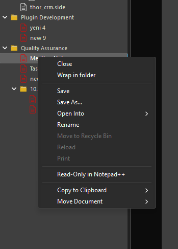
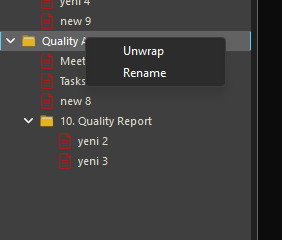
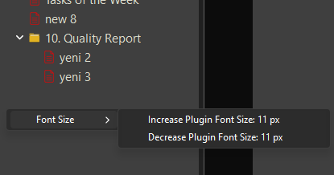

# Virtual Folders

Organize your projects and files the way you want, directly inside [Notepad++](https://github.com/notepad-plus-plus/notepad-plus-plus).

This plugin adds a dockable tree panel where you can create your own virtual folder structure. Group files from different paths, reorder them freely, and keep related resources together without touching the actual filesystem.

# Features

- Dockable tree panel with customizable layout
- Create and manage virtual folders  
  

    
  

- Add files from anywhere on your system
- Reorder and group items independent of the OS
- Quick navigation and context menu actions
  

    
    
  

- You can change the font size for the tree view  
  

    
  

# Why this plugin?
Working with many scattered files in `Notepad++` was frustrating. I wanted a simple way to arrange them logically without moving them on disk. Building this plugin was a long, stubborn effort—fighting Win32 quirks, `Notepad++` internals, and my own persistence. But the result is a tool I personally needed, and I hope it helps others too.

— Developed with patience (and coffee).

# Installation
Just unpack the VirtualFolder zip-archive (the last *dll*.zip under https://github.com/FatihC/VirtualFolders/releases ) to the folder `"Notepad++\plugins"`. It will extract the file `"VirtualFolders.dll"` as well as the `"localization"` subfolder.
 
After restarting `Notepad++`, you can toggle the Virtual Folders panel from `Plugins->Virtual Folders->Show Virtual Folders Panel` menu.

# Acknowledgments
This plugin was built using the [NppCppMSVS](https://github.com/Coises/NppCppMSVS). template
.
Special thanks to [Coises](https://community.notepad-plus-plus.org/user/coises) for creating and sharing such a helpful foundation.